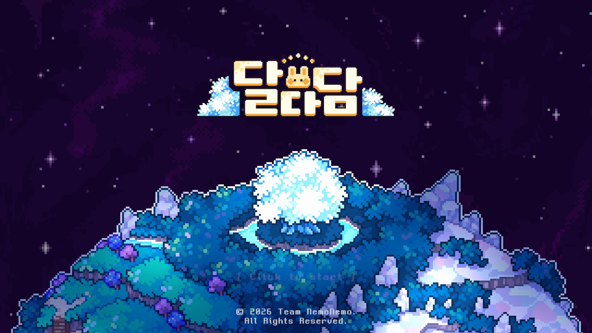
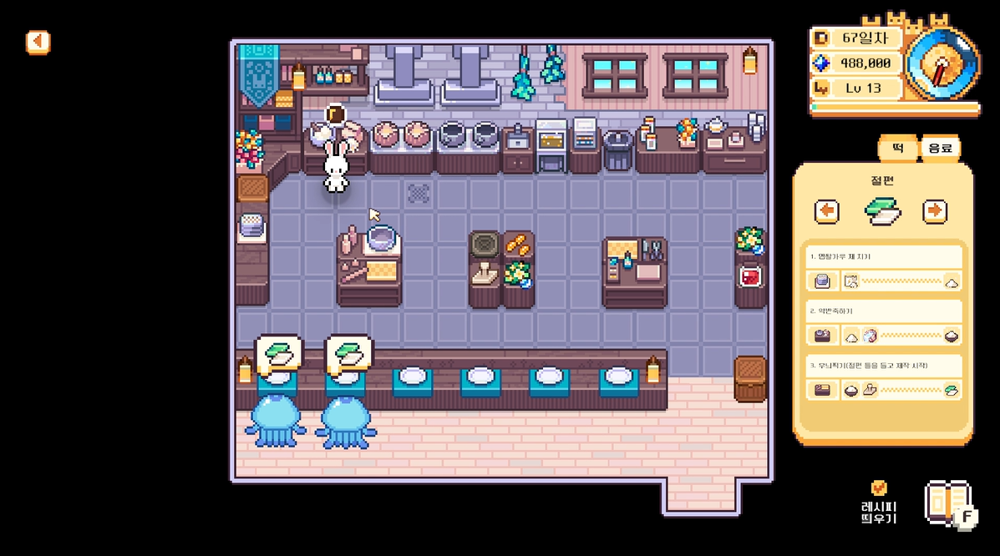
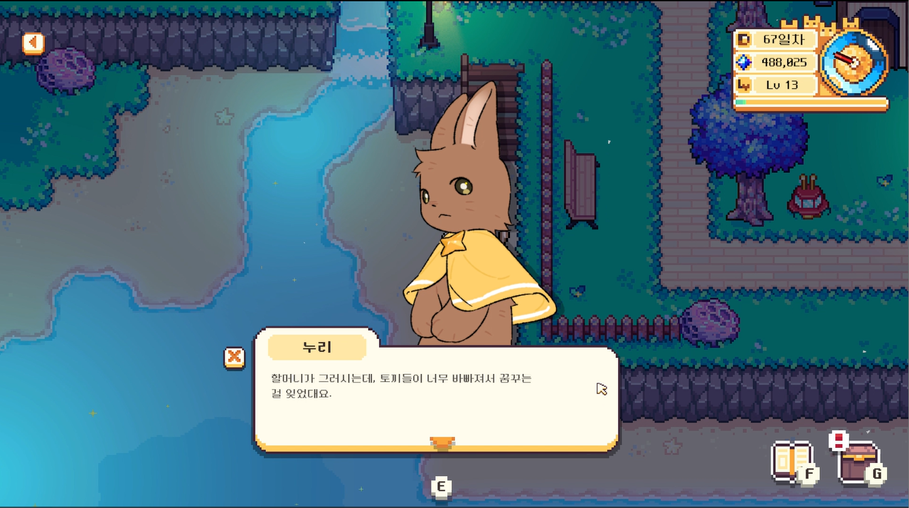

# 달다담 (Daldadam)

Unity 2D 클라이언트 프로그래밍 포트폴리오

  

  
  

게임 <달다담>은 달 토끼 마을에서 한국 전통 다과를 만들고 판매하며 성장하는 
2D 픽셀 힐링 경영 시뮬레이션 게임입니다.

## Project

- Engine: Unity 2022
- Language: C#
- Platform: PC
- Team: 4명 (기획 1 / 디자인 1 / 개발 2)
- Development: 2025.03 ~ 2026.09
- Role: Client Programming / Unity Development
- Contribution: 클라이언트 구현 약 80%
- Release: itch.io 출시 완료 / Steam 출시 예정

## My Responsibilities

- Save / Load 및 Save Slot
- Inventory / Crafting
- Farming / World Interaction
- NPC Dialogue / Tutorial
- Time / Level / Unlock
- Scene Transition / Cinemachine
- Settings / Audio
- Localization
- Cutscene / UI Integration

여러 시스템이 공유하는 데이터와 Scene 간 상태를 연결하고,  
클라이언트 기능의 통합 및 디버깅을 주로 담당했습니다.

## Main Systems

### Save / Load
Save Slot별 데이터를 분리하고, `SaveService` / `SaveRepository` / `SaveData`를 중심으로 저장 구조를 관리합니다.

### Crafting
`makerId`와 제작 상태를 기준으로 Scene 이동 이후에도 제작 진행 상태를 복원합니다.

### Unlock
레벨업 상태와 실제 콘텐츠 적용 상태를 분리하고, 다음 날 전환 시 예약된 해금을 적용합니다.

### Dialogue
`Queue`, `Dictionary`, Dialogue State를 이용해 대사, 선택지, 단계별 대화와 Localization을 처리합니다.

### Interaction
NPC, Crop, Held Item이 같은 입력을 사용할 때 상호작용 우선순위와 차단 상태를 관리합니다.

### Scene Transition
`entranceID`를 이용해 Scene 간 Spawn 위치를 전달하고 Player 배치와 Cinemachine 상태를 갱신합니다.

## Recommended Code Review Order

1. [`Save/SaveData.cs`](Assets/Scripts/Save/SaveData.cs)
2. [`Save/SaveService.cs`](Assets/Scripts/Save/SaveService.cs)
3. [`Save/SaveRepository.cs`](Assets/Scripts/Save/SaveRepository.cs)
4. [`Crafting/MakerManager.cs`](Assets/Scripts/Crafting/MakerManager.cs)
5. [`Unlock/UnlockManager.cs`](Assets/Scripts/Unlock/UnlockManager.cs)
6. [`Dialogue/NPCDialogueUIManager.cs`](Assets/Scripts/Dialogue/NPCDialogueUIManager.cs)
7. [`Interaction/NPCInteractable.cs`](Assets/Scripts/Interaction/NPCInteractable.cs)
8. [`SceneTransition/VillageSpawnDirector.cs`](Assets/Scripts/SceneTransition/VillageSpawnDirector.cs)
9. [`Time/TimeManager.cs`](Assets/Scripts/Time/TimeManager.cs)

## Gameplay

플레이 영상 업로드 예정

## Repository Scope

본 저장소는 포트폴리오 검토를 위해 제가 직접 구현하거나 주요하게 수정한  
클라이언트 코드 중심으로 구성했습니다.

팀원이 제작한 아트·사운드 등의 제작 리소스와  
일부 UI / Tutorial / Audio 보조 시스템은 제외했습니다.
